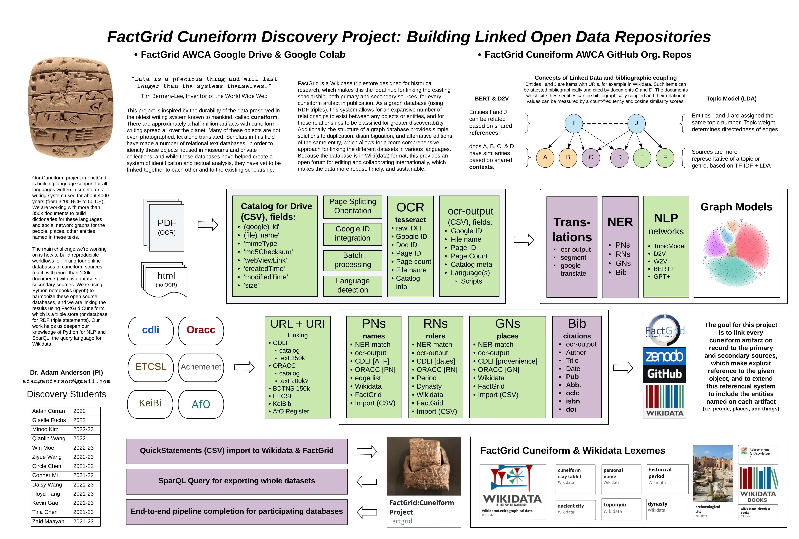

Welcome to the Poster presentations of the DANES conferences! Below you can view, explore and download some of the ground-breaking research in digital ancient Near Eastern studies.

## DANES 2023

### Beloved, Brother, Friend: Comparing Dumuzi Myths using Shallow Ontologies

Franziska Pannach ([University of Göttingen](https://orcid.org/0000-0003-4216-8410){:target="_blank"}) & Theresa Blaschke, ([University of Marburg](https://www.uni-marburg.de/de/staff-info?dn=y9ydw5bvz3){:target="_blank"})

<a href="https://doi.org/10.5281/zenodo.8273474" target="_blank">
  doi
</a>

Dumuzi is presented in different ways in Near Eastern myths. He is described as wild bull or man, sometimes he is part of a dedicated family structure or a separated entity. This poster presents eigth different views on the Mesopotamian deity, modelled as minimal (or shallow) ontologies, used to compare Dumuzi’s diverse representations. 

[Downloadable link](../images/posters/DANES2023/pannach-blaschke/pannach_blaschke.pdf){:target="_blank"} to the abstract and poster.

### FactGrid Cuneiform Discovery Project: Building Linked Open Data Repositories

Adam Anderson ([UC Berkeley](https://dlab.berkeley.edu/people/adam-anderson){:target="_blank"})

<a href="https://doi.org/10.5281/zenodo.8273419" target="_blank">
  doi
</a>

This project is inspired by the durability of the data preserved in the oldest writing system known to mankind, called cuneiform. There are approximately a half-million artifacts with cuneiform writing spread all over the planet. Many of these objects are not even photographed, let alone translated. Scholars in this field have made a number of relational text databases, in order to identify these objects housed in museums and private collections, and while these databases have helped create a system of identificaiton and textual analysis, they have yet to be linked together to each other and to the existing scholarship. FactGrid is a Wikibase triplestore designed for historical research, which makes this the ideal hub for linking the existing scholarship, both primary and secondary sources, for every cuneiform artifact in publication.

[Downloadable link](../images/posters/DANES2023/factgrid/FactGrid_AWCA-DANES_2023.pdf){:target="_blank"} to the poster.

### Material Culture from the Middle Babylonain Period (McMiB)

Sara Arroyo Cuadra ([UNED](https://portalcientifico.uned.es/investigadores/205113/detalle){:target="_blank"})

<a href="https://doi.org/10.5281/zenodo.8273344" target="_blank">
  doi
</a>

This poster aims to show the main objectives to be developed within the project "Material culture from Middle Babylonian period (McMiB): digitalization and democratization of the access to the cultural heritage of the Ancient Near East", funded thanks to a "María Zambrano" Postdoctoral Fellowship.

[Downloadable link](../images/posters/DANES2023/arroyo/arroyo_poster.pdf){:target="_blank"} to the abstract and poster.

### Towards Binarization of Iron Age Ostraca from Multispectral Weakly-Annotated Imaging

Ohr Dallal (Tel Aviv University), Shira Faigenbaum-Golovin ([Duke University](https://math.duke.edu/shira-faigenbaum-golovin){:target="_blank"}), Israel Finkelstein ([Haifa University](https://samc.haifa.ac.il/prof-israel-finkelstein/?lang=en&csrt=13587117137429980830){:target="_blank"}), Nachum Dershowitz ([Tel Aviv University](https://www.cs.tau.ac.il/~nachumd/Homepage.html){:target="_blank"})

<a href="https://doi.org/10.5281/zenodo.8273426" target="_blank">
  doi
</a>

Image binarization is one of the essential and preliminary steps towards many document processing tasks. We aim to binarize Iron Age Hebrew ostraca, which are of great importance to the historical study of ancient Israel and Judah. To this end, a new and unique dataset is introduced, consisting of multispectral ostraca images taken at different camera wavelengths. 

[Downloadable link](../images/posters/DANES2023/ohr/ohr_abstract+poster.pdf){:target="_blank"} to the abstract and poster.

### Universal dependencies for Hittite

Maria Molina ([Tel Aviv University](https://telaviv.academia.edu/MariaMolina/CurriculumVitae){:target="_blank"})

<a href="https://doi.org/10.5281/zenodo.8273313" target="_blank">
  doi
</a>

In the recent years universal dependencies (UD) became the standard for digital treebanks, they are an essential part of annotated linguistic corpora, and they are widely used for comparison of language features in linguistic research. This paper describes the UD annotation for Annotated Corpus of Hittite Clauses (ACHC). It is an ongoing project, starting from previously achieved number of UD-annotated clauses.

[Downloadable link](../images/posters/DANES2023/ACHC/ACHC.pdf){:target="_blank"} to the abstract and poster.

### Workflow of Cune-iiif-orm

Gustav Ryberg Smidt ([Ghent University](https://research.flw.ugent.be/nl/gustavryberg.smidt){:target="_blank"}), Katrien De Graef ([Ghent University](https://research.flw.ugent.be/en/katrien.degraef){:target="_blank"}), Lise Foket ([Ghent University](https://research.flw.ugent.be/nl/lise.foket){:target="_blank"}) & Hendrik Hameeuw ([KU Leuven](https://www.kuleuven.be/wieiswie/en/person/00045269){:target="_blank"})

<a href="https://doi.org/10.5281/zenodo.8273384" target="_blank">
  doi
</a>

The strategy of the project is to create digital versions of OB tablets within IIIF, publish them in both physical and digital editions and analyse a large corpus of OB cuneiform tablets with computational methods.

[Downloadable link](../images/posters/DANES2023/cune-iiif-orm/poster_danes_cune-iiif-orm.pdf){:target="_blank"} to the poster.

